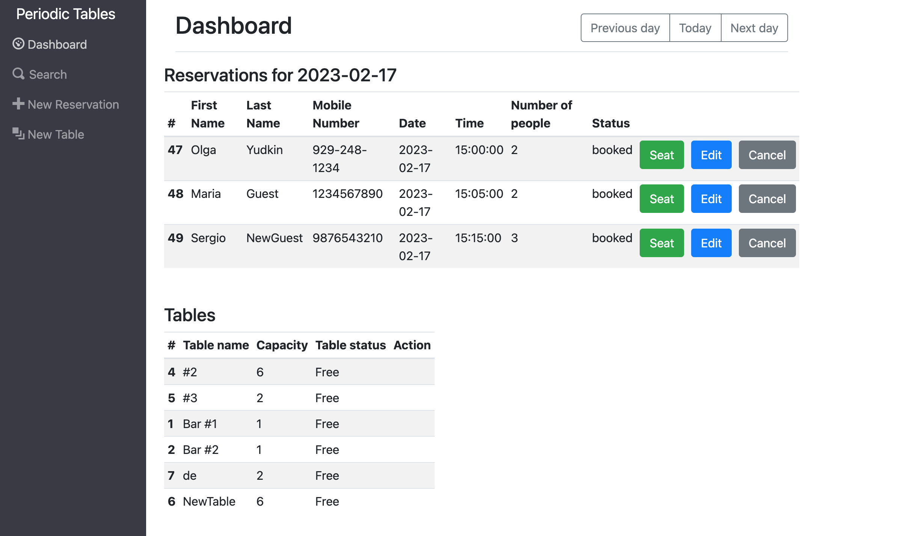
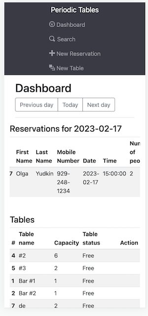

# Capstone: Restaurant Reservation System

> This is a reservation system for fine dining restaurants.
> The software is used only by restaurant personnel when a customer calls to request a reservation. It allows restaurant managers to create, update and save reservations, search for reservations by customer's phone number, create new tables and assign tables to reservations as well as free up tables once reservations are done with their meal. The application is fully responsive and can adapt to screens of all sizes.

## Deployed version

Frontend:
Backend:

## Technologies used

| Backend | Frontend |
| :-------| :--------|
| Node.js | React    |
|Express  | Javascript|
|PostgreSQL |Bootstrap|
|Knex    | CSS         |

## API

The API allows to create, update, read and list records. User cannot delete records.

## Design

### DASHBOARD

Dashboard displays the list of reservations for today by default. _Previous_ and _Next_ buttons allow user to display reservations for past and future dates.

* Desktop view

* Mobile view

### CREATE RESERVATION

Users can create a new reservation by clicking _New reservation_ on the navigation bar. 

* Desktop view

- Mobile view

### UPDATE RESERVATION

Users can update existing reservation by clicking _Edit_ button next to the reservation.

- Desktop view

- Mobile view

### SEARCH FOR RESERVATIONS

In order to search for a reservation users need to click _Search_ on the navigation bar. The search can be done by a phone number and will display all records that match partially or completely.

- Desktop view

- Mobile view

### CREATE NEW TABLE

Users can create a new table by clicking _New table_ on the navigation bar.

- Desktop view

- Mobile view

### SEAT RESERVATION

Users can 'seat' a reservation by clicking _Seat_ button dsiplayed next to an existing reservation. The _Seat_ button is only displayed next to reservations whose status 'booked'. Once the reservation is seated the button will disappear  and reservation status will be displayed as 'seated'.

- Desktop view

- Mobile view

### FINISH TABLE

Seated tables display _Finish_ button clicking which the table will be cleared and available for seating again.

- Desktop view

- Mobile view

## Installation

1. Fork and clone this repository.
1. Run `cp ./back-end/.env.sample ./back-end/.env`.
1. Update the `./back-end/.env` file with the connection URL's to your ElephantSQL database instance.
1. Run `cp ./front-end/.env.sample ./front-end/.env`.
1. You should not need to make changes to the `./front-end/.env` file unless you want to connect to a backend at a location other than `http://localhost:5001`.
1. Run `npm install` to install project dependencies.
1. Run `npm run start:dev` to start your server in development mode.

## Running tests

Test are split up by user story. You can run the tests for a given user story by running:

`npm run test:X` where `X` is the user story number.

Have a look at the following examples:

- `npm run test:1` runs all the tests for user story 1 (both frontend and backend).
- `npm run test:3:backend` runs only the backend tests for user story 3.
- `npm run test:3:frontend` runs only the frontend tests for user story 3.

All Tests

- `npm test` runs _all_ tests.
- `npm run test:backend` runs _all_ backend tests.
- `npm run test:frontend` runs _all_ frontend tests.
- `npm run test:e2e` runs only the end-to-end tests.

